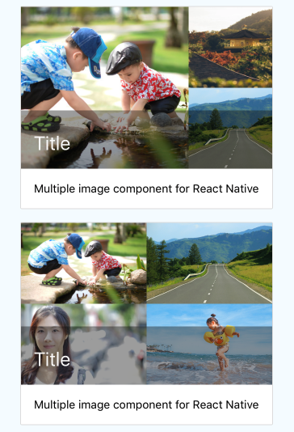

## react-native-card-media
Card Media component for React Native. Also supports multiple image layout.

#### single & double  


#### three & four



#### five


## Installation

`npm install react-native-card-media --save`

## Examples
[CardMediaExample](https://github.com/dondoko-susumu/react-native-card-media-example/blob/master/App.js)

## Usage
```javascript
const files5 = [
  `${path}kids_play_640.jpeg`,
  `${path}road_640.jpg`,
  `${path}women_640.jpeg`,
  `${path}sea_kids_640.jpeg`,
  `${path}temple_640.jpeg`,
];

<CardMedia
  files={files5}
  style={{ height: 200 }}
  title="Title"
  showTitle={false}
  titleStyle={{ fontSize: 24, fontWeight: '400', lineHeight: 32, color: '#fafafa' }}
  onPress={(fileIndex) => this.onPress(fileIndex)}
  imageIconView={this.renderImageIconView}
  imageCountStyle={{ fontSize: 20, fontWeight: '500', lineHeight: 28, color: '#fafafa' }}
  imageTouchable={false}
/>
```

## Props
| Prop | Description | Type | Default |
| ------------- | ------------- | ------------- | ------------- |
| **files**  | Media lists | Array | **Required**  |
| **style**  | CardView style   | View Style Object | undefined  |
| **title**  | Title text is shown at below part of card | String | undefined |
| **showTitle**  | Title is shown or not | Boolean  | true |
| **titleStyle**  | Title style | View Style Object | undefined |
| **onPress**  | Action is called when click in card | Function | undefined |
| **imageIconView**  | Icon is shown near title | Component | undefined |
| **imageCountStyle**  | Icon style | View Style Object | undefined |
| **imageTouchable**  | Images in card is clickable or not | Boolean | true |

## License
MIT
